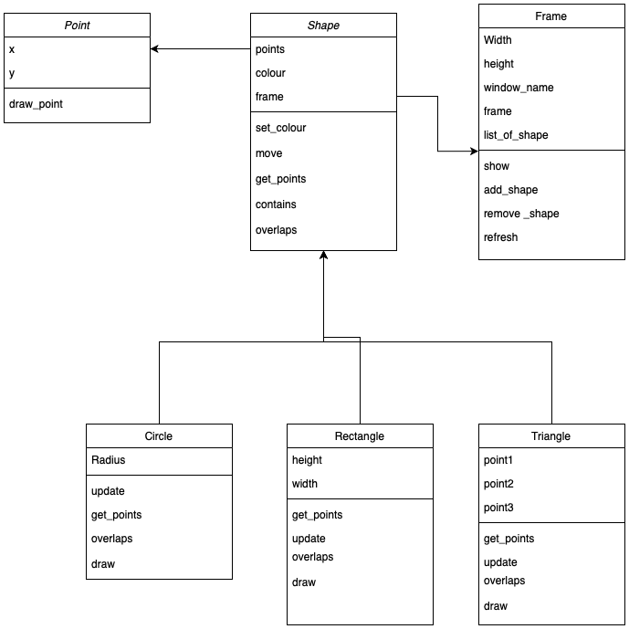

# Shape Drawing and Intersection Detection

This project provides a set of classes to represent and manipulate geometric shapes (Rectangle, Circle, Triangle) and display them using OpenCV. It also includes functionality to check if a point is inside a shape and if two shapes overlap.


## Installation


1. Create a virtual environment and activate it:
    ```sh
    python -m venv venv
    source venv/bin/activate 
    ```

2. Install the required packages:
    ```sh
    pip install -r requirements.txt
    ```

## Usage

Here is an example of how to use the classes to create and display shapes:

```python
from frame import Frame
from shapes import Point, Rectangle
import cv2
import time

def main():
    main_frame = Frame(800, 600)
    rectangle = Rectangle(Point(400, 300), 100, 200, main_frame, 0)  # Initial rotation 0 degrees
    rectangle.set_colour((0, 255, 0))
    delta_degrees = 0
    while True:
        delta_degrees =delta_degrees + 30
        main_frame.show()
        # time.sleep(0.1)  # Refresh every 0.1 seconds
        rectangle.update(Point(400, 300), 100, 200, delta_degrees)  # Rotate 30 degrees on every refresh
        #exit loop after 360 degrees
        if delta_degrees == 360:
            break
if __name__ == "__main__":
    main()
```

NOTE: The main.py is just an example of how to use the classes. It does not have any user interaction or main loop and will render the frame when pressing any key.

## How the pipeline works

1. Create a frame with a specified width and height.
2. Create a shape (Rectangle, Circle, Triangle) with a specified position, size, and rotation.
3. All shapes when created are added to the frame.
4. Call the `show()` method of the frame to display all shapes. The frame automically refresh/ redraw all the shapes in the frame on every call to `show()`.
5. Call the `update()` method of the shape to update its position, size, and rotation. The frame will automatically update the shape on the next call to `show()`.
6. Pressing the 'q' key will *NOT* close the window. But will continue to run the next line in code. This is different from typical OPENCV behaviour where pressing 'q' key will close the window.

## Class Structure

Has 3 base classes
1. Frame
2. Shape
3. Point

Has 3 derived classes
1. Rectangle
2. Circle
3. Triangle

1. Frame class
- Is the primary container for all shapes and includes functions to display all shapes in the frame.
- Keeps track of all shapes in the frame and displays them using OpenCV.


2. Shape class
- Is the  base for all shapes and includes functions to create and add to the frame.
- Has functions to check if a point is inside the shape and if two shapes overlap.

3. Point class
- Represents a point in 2D space . NOTE: I wouldnt have personally used this class but it is created for the sake of OO design.

3. Inherted Classes
- Each inherited classes have methods to update the shape and display it and also extend or overide the base class methods.



## Runing the code

```sh
python src/main.py
```

## Testing

```sh
python -m unittest discover -s src -p "test_shapes.py"
```